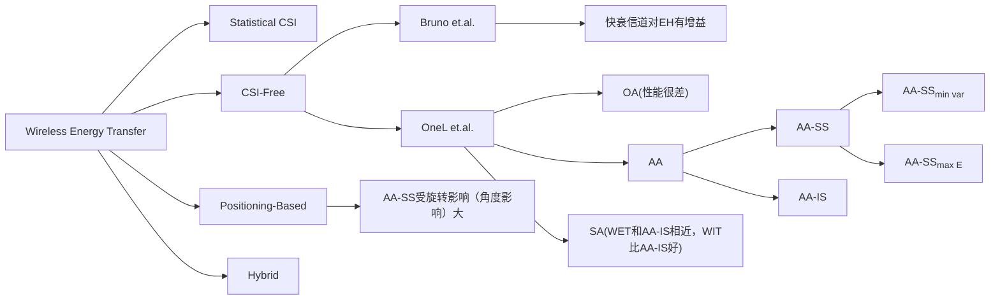

# CSI-Free 总结

## 研究现状

无线能量传输（WET/WPT）,经历了从①设计更好的接收机电路$$\to$$②设计能量波束赋形（Energy Beamforming）$$\to$$③设计能量波形（Energy Waveform）$$\to$$④设计能量调制（Energy Modulation）等阶段。到现在研究主要分四个方向：

- Partial CSI-Based EB/Statistical CSI: 统计CSI，不是瞬时的
  - 在大时间内变化， 而不需要频繁更新。
  - 有限CSI采集开销和能量消耗得到。
  - 更不容易出错（统计的）
- CSI-Free：不需要CSI，具体有三种算法
  - [APS-EMW](https://lcjoffrey.top/2022/03/20/CSI-FREE-Transmit-diversity/)[^1]
  - [AA-IS/SA](https://lcjoffrey.top/2022/03/27/OnCSIFree/)[^2][^3]
  - [AA-SS 两种](https://lcjoffrey.top/2022/03/27/OnCSIFree/)[^2][^3]
- Positioning-Based：在CSI-Free的基础上，通过位置信息，旋转PB的天线以获得更好的性能（AA-SS可以从中获得较好的增益）
- Hybrid：混合模式，结合Perfect CSI、Limit CSI、CSI-free、Positioning-Based EB等。例如在IoT设备电量较低时先通过CSI-Free传输能量，电量得到补充后，可以传输导频，再使用perfect CSI等。

目前主要调研的是CSI-Free算法。主要有由Bruno等人研究的构造快衰信道来实现能量接收端增益[^1]和Onel等人研究的多天线发射机和单天线接收机的结构[^2][^3]。

### 构造快衰信道实现WET的增强

#### 衰落对能量接收的增强

Bruno Clerckx等人提出，信道衰落（fading）对能量收集（EH）是有益的：这是因为能量接收器通常是**非线性的**。**对这个非线性特性的能量接收模型进行四阶泰勒展开，得到有衰落的情况下，能量受益增大**。但同时，衰落会降低信道容量，意味着对WIT有害。

#### 分集对能量接收的增强

基于此结论，仅考虑WPT（或者称为WET），使用分集发射，即在每根天线上添加一个时变的相位$$\psi_m(t)$$，如下图所示：

则发射端信号为：
$$
\begin{aligned}
x_m(t)&=\sqrt{\frac{2P}{M}}\cos(w_0t+\psi_m(t))\\
&=\sqrt{\frac{2P}{M}}\Re\{e^{j(w_0t+\psi_m(t))}\}
\end{aligned}
$$
其中$$P$$为总能量；$$M$$为天线个数；$$\Re(\cdot)$$为取实部。

接收端信号为：
$$
y(t)=\sqrt{\frac{2P}{M}}\mathscr\{\Lambda^{-1/2}h(t)e^{jw_0t}\}
$$
其中：
$$
h(t)=\sum\limits_{m=1}^Mh_me^{j\psi_m(t)}
$$
其中，接收天线的路径损耗和衰落为$$\Lambda ^{-1/2}h_m$$。

**可以理解为分集在衰落上$$h$$上乘了一个系数，创造了一个快衰信道，结合衰落使能量接收增加的特点，使能量接收增益增大**

#### 天线数目对能量收集器的增强

建模出来在泰勒展开四阶项中有一个系数$$G_{td}=(1+\frac{M-1}{M})$$，即有如下趋势：

进一步，还可以结合Energy Modulation和Energy Waveforming来进一步增强能量接收。

### 讨论不同发射机结构对WET的影响

以下内容中，接收机都是单天线设备。

#### OA（only  antenna）：发射机为单天线，单天线全功率输出。性能很差。

#### AA（all antenna）：发射机为多天线，功率平均分配。可以选择不同的侧重优化方式和不同的发射信号。

- AA-SS：多天线，每根天线发射相同的信号。根据优化需求，分为$$AA-SS_{\min var}$$和$$AA-SS_{\max E}$$

$$AA-SS_{\min var}$$优化结果为，能量信号与发射机天线（ULA）的法线方向平行（能量信号方向与天线夹角为0度），此时取得接收机能量有最小方差，但此时均值最小。

$$AA-SS_{\max E}$$优化结果为，能量信号与发射机天线（ULA）的法线方向垂直（能量信号方向与天线夹角为90度），且天线与天线之间存在$$\pi$$相位差，此时取得接收机能量有最大均值，但此时方差最大。

- AA-IS：多天线，每根天线发射i.i.d.信号。和下面的SA性能接近

#### SA（Switching Antennas）：多天线，每次选一根天线全功率输出，输出时间是总时间的$$1/M$$。性能和AA-IS相似，但是只需要一个发射链路，方差小（均值与AA-SS相比也小）。

注意，由于$$SA$$实现简单，而且可以很好地利用其余天线做WIT发射分集，所以$$SA$$和$$AA-IS$$相比，肯定选择$$SA$$。

##　对比[^4]

由图可知，APS-EMW和AA-IS/SA策略的接收能量都比较发散（均匀）。而AA-SS的两种优化形式都比较具有方向性。

APS-EMW的低能量区域比较大，只适用于一些低能量要求的场景，如下图所示：

注意到，$$AA-SS_{\min var}$$全能量值覆盖区间都比较低；$$AA-SS_{\max E}$$具有全能量值覆盖区间都高；$$SA$$和$$AA-IS$$介于二者中间。

*虽然总结上写SA/AA-IS不适合结合IRS，因为其能量传输是全方位的。但换个角度讲，SA方案方差性能比较好，但能量传输不具有方向性，IRS是否可以作为集中SA发射能量的一种方式？？*

## CSI-Free versus CSI-Based[^5]

这里对比的是CSI-Free和CSI-Based在WPCN情况下的性能，因为作者认为，WIT是较少发生的，WPT/WET是持续发生的。所以作者考虑WPCN系统而不是SWIPT系统。

CSI-Free采取SA，CSI-Based采取MMSE进行波束形成（precoding）(同时证明了在文章设置中，MMSE比ZF好)

作者考虑了两种情况：

- WIT事件出现$$\sim$$Periodic Traffic
- WIT事件出现$$\sim$$Possion Traffic

得到一些主要结论（结论有很多，这里只写了主要结论，其余见原文或者[我的笔记](https://lcjoffrey.top/2022/03/29/CSIFreeversusCSIBased/)）

- CSI-Free和CSI-Based在接收机数量/节点数量$$\to\infty$$时相同，因为CSI-Free和接收机数量无关（不需要波束形成），而CSI-Based随接收机数量增多，天线波束增益下降

- CSI-Free在Periodic Traffic 情况下是比较好的，但Periodic Traffic  情况下不太行
- Possion Traffic **存在一个最佳的碰撞概率**

## Reference

[^1]: B. Clerckx and J. Kim, "On the Beneficial Roles of Fading and Transmit Diversity in Wireless Power Transfer With Nonlinear Energy Harvesting," in IEEE Transactions on Wireless Communications, vol. 17, no. 11, pp. 7731-7743, Nov. 2018, doi: 10.1109/TWC.2018.2870377.
[^2]: O. L. A. López, H. Alves, R. D. Souza and S. Montejo-Sánchez, "Statistical Analysis of Multiple Antenna Strategies for Wireless Energy Transfer," in IEEE Transactions on Communications, vol. 67, no. 10, pp. 7245-7262, Oct. 2019, doi: 10.1109/TCOMM.2019.2928542.
[^3]: O. L. A. López, S. Montejo-Sánchez, R. D. Souza, C. B. Papadias and H. Alves, "On CSI-Free Multiantenna Schemes for Massive RF Wireless Energy Transfer," in IEEE Internet of Things Journal, vol. 8, no. 1, pp. 278-296, 1 Jan.1, 2021, doi: 10.1109/JIOT.2020.3003114.
[^4]: O. L. A. López, H. Alves, R. D. Souza, S. Montejo-Sánchez, E. M. G. Fernández and M. Latva-Aho, "Massive Wireless Energy Transfer: Enabling Sustainable IoT Toward 6G Era," in IEEE Internet of Things Journal, vol. 8, no. 11, pp. 8816-8835, 1 June1, 2021, doi: 10.1109/JIOT.2021.3050612.
[^5]: O. L. A. López, N. H. Mahmood, H. Alves and M. Latva-aho, "CSI-Free vs CSI-Based Multi-Antenna WET for Massive Low-Power Internet of Things," in IEEE Transactions on Wireless Communications, vol. 20, no. 5, pp. 3078-3094, May 2021, doi: 10.1109/TWC.2020.3047355.
